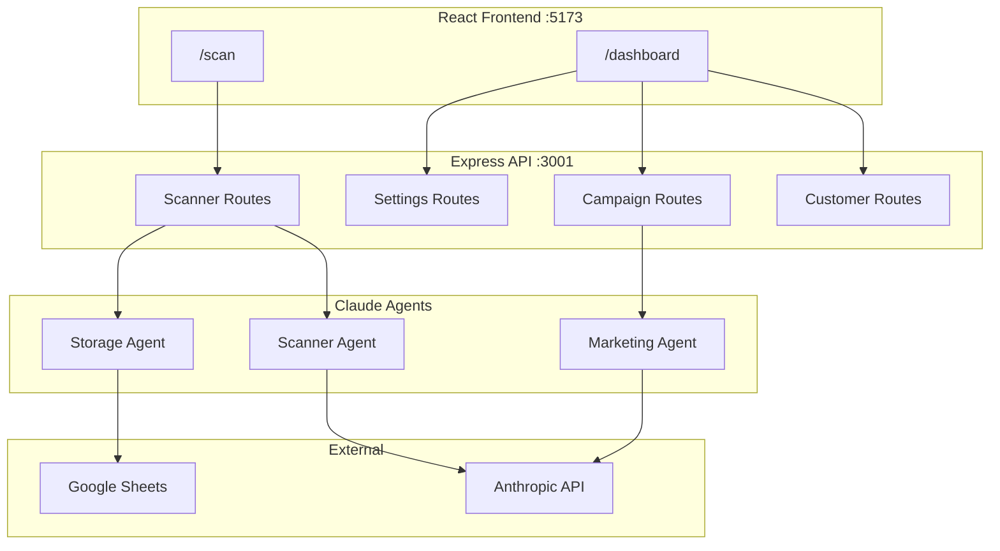

# The Groomers Unisex Salon — CRM Walkthrough

## What Was Built

A full-stack Salon CRM with **3 AI agents**, **glassmorphism UI**, and **Google Sheets database**, featuring:

- **Customer Scanner** (`/scan`) — Public kiosk page for customer onboarding + cashback
- **Owner Dashboard** (`/dashboard`) — Private panel for customer management, campaigns, and analytics
- **Multi-Agent Backend** — Scanner, Storage, and Marketing agents powered by Anthropic API

---

## Application Screenshots

### Scanner Flow — Returning Customer

````carousel

<!-- slide -->

<!-- slide -->

<!-- slide -->

````

### Owner Dashboard

````carousel

<!-- slide -->

<!-- slide -->

````

---

## Architecture



---

## File Structure

| Directory | Key Files | Purpose |
|-----------|-----------|---------|
| `src/pages/` | [ScanPage.jsx](file:///d:/Antigravity/ProjectTest/src/pages/ScanPage.jsx), [DashboardPage.jsx](file:///d:/Antigravity/ProjectTest/src/pages/DashboardPage.jsx) | Page-level components |
| `src/components/Scanner/` | [PhoneInput](file:///d:/Antigravity/ProjectTest/src/components/Scanner/PhoneInput.jsx), [OnboardingForm](file:///d:/Antigravity/ProjectTest/src/components/Scanner/OnboardingForm.jsx), [WelcomeBack](file:///d:/Antigravity/ProjectTest/src/components/Scanner/WelcomeBack.jsx), [BillInput](file:///d:/Antigravity/ProjectTest/src/components/Scanner/BillInput.jsx), [CashbackReward](file:///d:/Antigravity/ProjectTest/src/components/Scanner/CashbackReward.jsx) | Scanner flow steps |
| `src/components/Dashboard/` | [PinGate](file:///d:/Antigravity/ProjectTest/src/components/Dashboard/PinGate.jsx), [Sidebar](file:///d:/Antigravity/ProjectTest/src/components/Dashboard/Sidebar.jsx), [CustomerTable](file:///d:/Antigravity/ProjectTest/src/components/Dashboard/CustomerTable.jsx), [CampaignComposer](file:///d:/Antigravity/ProjectTest/src/components/Dashboard/CampaignComposer.jsx), [AnalyticsCards](file:///d:/Antigravity/ProjectTest/src/components/Dashboard/AnalyticsCards.jsx), [SettingsPanel](file:///d:/Antigravity/ProjectTest/src/components/Dashboard/SettingsPanel.jsx) | Dashboard tabs |
| `src/context/` | [ScannerContext](file:///d:/Antigravity/ProjectTest/src/context/ScannerContext.jsx), [DashboardContext](file:///d:/Antigravity/ProjectTest/src/context/DashboardContext.jsx) | State management |
| `src/styles/` | [globals.css](file:///d:/Antigravity/ProjectTest/src/styles/globals.css), [glassmorphism.css](file:///d:/Antigravity/ProjectTest/src/styles/glassmorphism.css), [animations.css](file:///d:/Antigravity/ProjectTest/src/styles/animations.css) | Design system |
| `server/agents/` | [scannerAgent](file:///d:/Antigravity/ProjectTest/server/agents/scannerAgent.js), [storageAgent](file:///d:/Antigravity/ProjectTest/server/agents/storageAgent.js), [marketingAgent](file:///d:/Antigravity/ProjectTest/server/agents/marketingAgent.js) | Claude-powered agents |
| `server/routes/` | [scanner](file:///d:/Antigravity/ProjectTest/server/routes/scanner.js), [customers](file:///d:/Antigravity/ProjectTest/server/routes/customers.js), [campaigns](file:///d:/Antigravity/ProjectTest/server/routes/campaigns.js), [settings](file:///d:/Antigravity/ProjectTest/server/routes/settings.js) | API endpoints |
| `server/services/` | [googleSheets](file:///d:/Antigravity/ProjectTest/server/services/googleSheets.js) | Google Sheets CRUD |

---

## What Was Tested

| Flow | Result |
|------|--------|
| Scanner — phone input + validation | ✅ Working |
| Scanner — returning customer (Welcome Back 3D flip) | ✅ Working |
| Scanner — bill input with real-time cashback calc | ✅ Working |
| Scanner — cashback reward with confetti burst | ✅ Working |
| Scanner — new customer onboarding form | ✅ Working |
| Dashboard — PIN gate (1234) | ✅ Working |
| Dashboard — customer table with 7 demo records | ✅ Working |
| Dashboard — filter chips (All/New/Regular/VIP) | ✅ Working |
| Dashboard — analytics with computed metrics | ✅ Working |
| Dashboard — settings with QR code generator | ✅ Working |
| Dashboard — campaign composer with demo variants | ✅ Working |
| API proxy (Vite → Express) | ✅ Working |
| Demo mode (no Google Sheets) | ✅ Working |

---

## How to Run

```bash
# Start both frontend + backend
npm run dev

# Frontend: http://localhost:5173
# Backend:  http://localhost:3001
```

## Deployment — Next Steps

1. **Google Cloud Setup**: Create project → enable Sheets API → create service account → share Sheet with service account email
2. **Create `.env`** with real credentials:
   ```
   ANTHROPIC_API_KEY=sk-ant-...
   GOOGLE_SHEETS_ID=1abc...
   GOOGLE_SERVICE_ACCOUNT_JSON={"type":"service_account",...}
   DASHBOARD_PIN=your-secret-pin
   ```
3. **Deploy**: Push to Vercel/Netlify with env variables
4. **Print QR**: Use the Settings tab QR code pointing to `https://yourdomain.com/scan`
5. **Place at counter**: Customers scan → onboard → earn cashback
